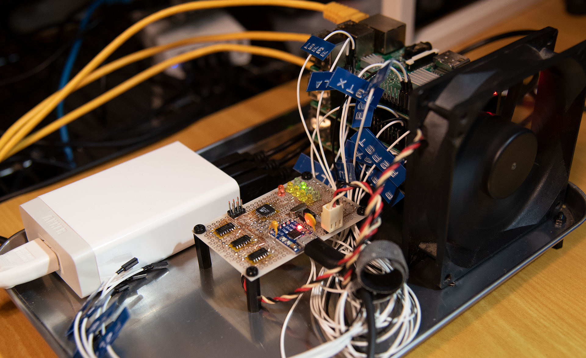
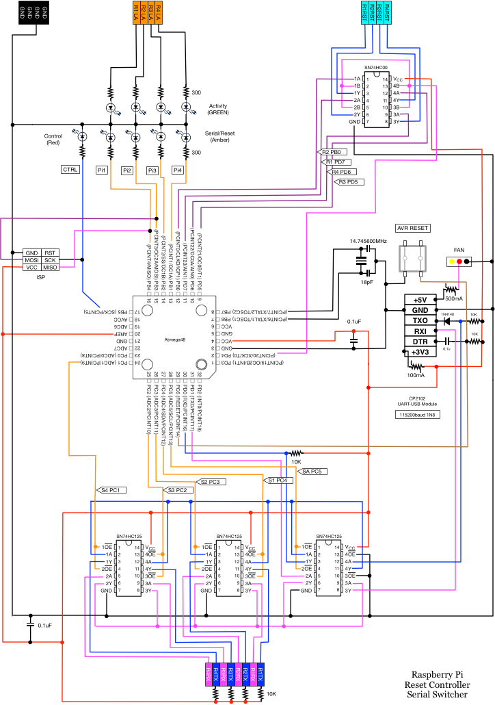

# Raspberry Pi ミニクラスター コントローラ

* 4台のRaspberry PiのリセットをUSB-Serialポート経由で実行します
* 4台のRaspberry PiのUARTを切り替えます

# 回路図

# ビルドおよびAVRへの書き込み方法

ビルドにはgolang, make, gcc, avr-gcc などが必要です。

	$ make

AVRへの書き込みには、AVRISP Mk2が必要です。

	$ make flash

# 使い方

	screen /dev/ttyUSB0 115200

メニューがでるので、リセットもしくはシリアル切り替えしたいRaspberry Piを選択します

シリアル切り替え後再度メニューに戻るにはAVRをリセットする必要があります。toggle-dtrを実行するとAVRをリセットできます。

	toggle-dtr/toggle-dtr /dev/ttyUSB0

