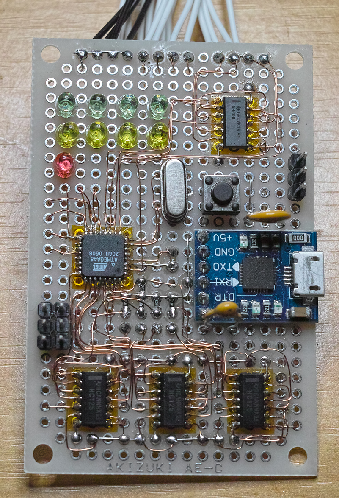
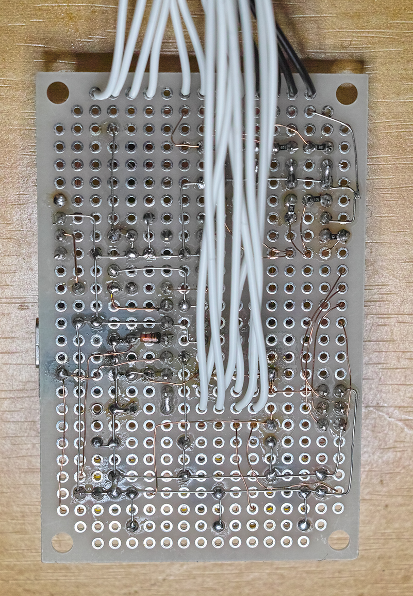

# Raspberry Pi ミニクラスター コントローラ

* 4台のRaspberry PiのリセットをUSB-Serialポート経由で実行します
* 4台のRaspberry PiのUARTを切り替えます

* 主にポリウレタン被覆線(UEW)とスズメッキ軟銅線をつかって配線しました。

# 回路図

この回路図ではISPのRSTが繋がっていないが、PC6(RESET)と接続する必要がある。

# ビルドおよびAVRへの書き込み方法

ビルドにはgolang, make, gcc, avr-gcc などが必要です。

	$ make

AVRへの書き込みには、AVRISP Mk2が必要です。

	$ make flash

# 使い方

	screen /dev/ttyUSB0 115200

メニューがでるので、リセットもしくはシリアル切り替えしたいRaspberry Piを選択します

シリアル切り替え後再度メニューに戻るにはAVRをリセットする必要があります。toggle-dtrを実行するとAVRをリセットできます。

	toggle-dtr/toggle-dtr /dev/ttyUSB0

# あぶないCP2102モジュール

はじめはCP2102モジュールから3.3Vをとる形でしたが、
モジュールに問題があり3.3V端子から4.2Vが出力されていたため回路電圧も4.2Vになっていました。
現在は5Vに別途レギュレータを追加して、そこから3.3Vを得ています。

TXOからも4.2Vでているのですが、
逆流防止のダイオードとプルアップ抵抗をいれていたため、
74HC125には電源電圧の3.3Vがかかっています。

パターンカットで修復することができますが、
ボードにボンドでガッチリ固定してしまい
パターンカットに失敗したら交換が大変なため、先述の方法で対応しています。

私の確認した限り、問題のあるCP2102モジュールには次の特徴があるようです。

* ポリスイッチがあるべき場所に0Ωの抵抗
* 裏面に「CJMCU」のシルク印刷がない
* RSTピンがVUSBに繋がっている

RSTピンとVUSBをパターンカットすれば正しく3.3Vがでるようです。

なお、これに該当するものでも、正しいパターンになっているものがあります。

新しいロットでは修繕されいるのかもしれません。

参考: [USB-シリアル変換器「CP2102モジュール」に要注意](https://ehbtj.com/electronics/beware-of-cp2102-module/)

