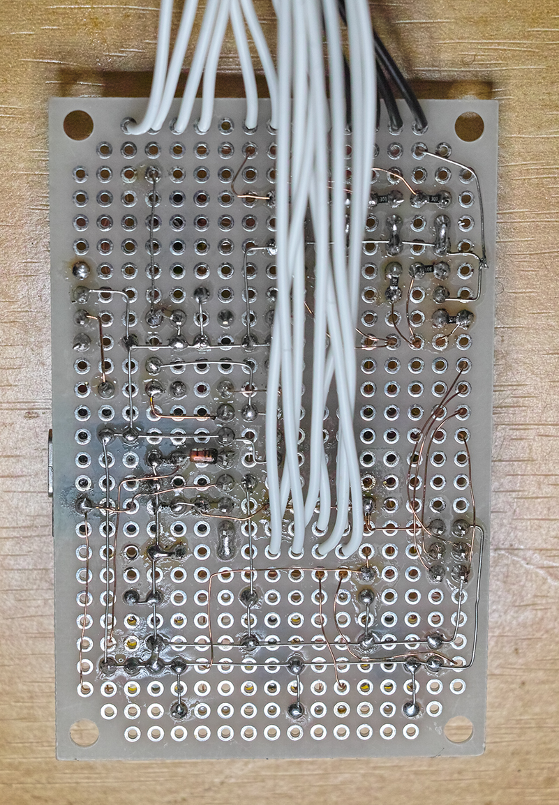

# 基盤の紹介

* 主にポリウレタン被覆線(UEW)とスズメッキ軟銅線をつかって配線しました。

# 基盤部拡大

# あぶないCP2102モジュール

はじめはCP2102モジュールから3.3Vをとる形でしたが、モジュールに問題があり3.3V端子から4.2Vでてくるので、
現在は5Vから別途レギュレータを通して3.3Vを得ています。
TXOも4.2Vでていますが、電源電圧以上で規格外なのでよくないですが、74HC125が受け止めています。ダイオードで制限回路を入れたいですね。
パターンカットで対応できますが、ボードにガッチリ固定してしまったので失敗したら面倒なので別の方法で対応しています。

CP2102モジュールを使う際はご注意ください。

### 参考

[USB-シリアル変換器「CP2102モジュール」に要注意](https://ehbtj.com/electronics/beware-of-cp2102-module/)

